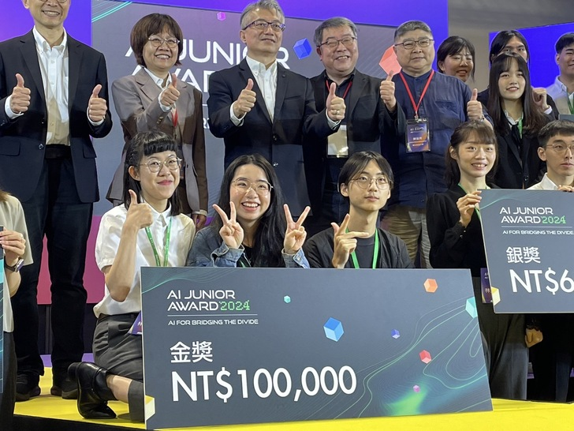
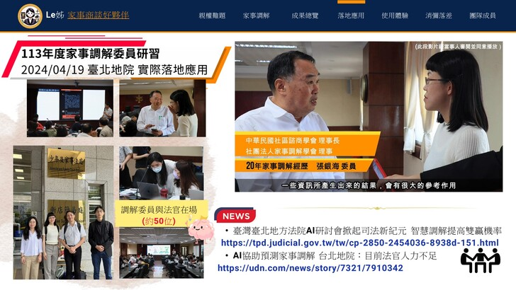
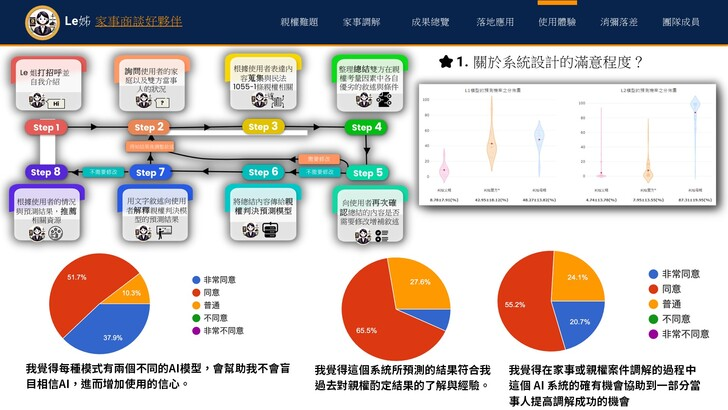
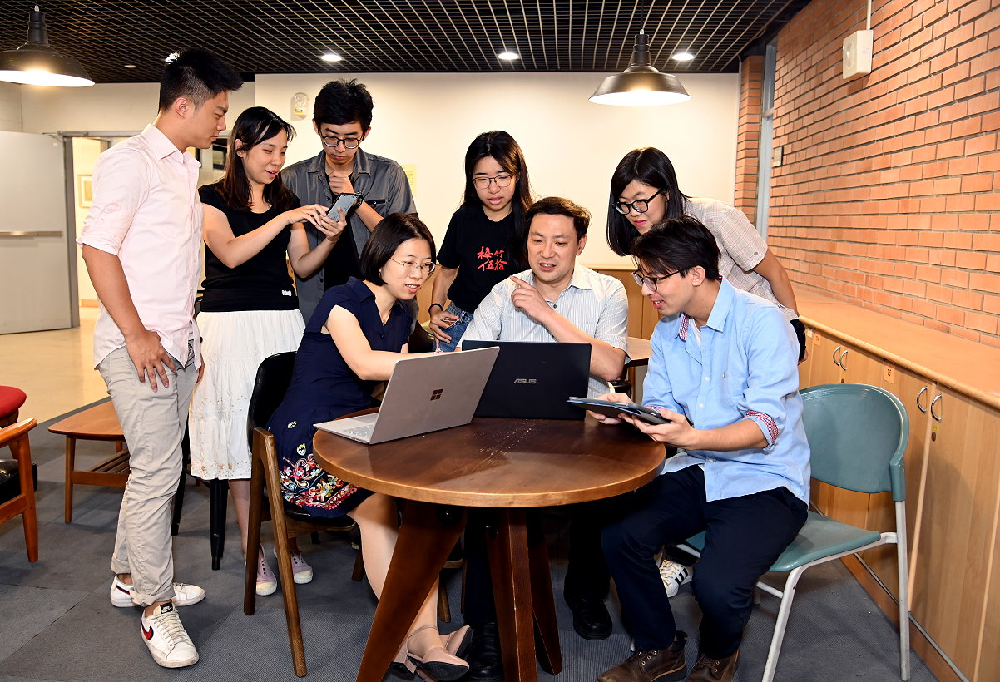

## ◎ 4/26/2024

研究團隊中阮羿寧、林雲貂和歐予恩三位同學，開發本系統第三代「 Le姊家事協商好夥伴 」在Digitimes與人工智慧基金會主辦的2024 Taiwan Al Expo(目前台灣最大的AI展覽會)中，獲得AI Junior Award的金獎與企業實務獎兩項大獎的肯定！

**相關報導：**

- [財團法人人工智慧基金會FB](https://www.facebook.com/share/p/L1sNSPhYFZx2nJdY/?mibextid=oFDknk)

**相關連結：**

- [比賽官網](https://www.digitimes.com.tw/ai_expo_2024/award_news.html)
- [參賽作品網站](https://hssai-custodiai.phys.nthu.edu.tw/ai_junior_award)

**參展介紹影片：**

    <iframe class="aspect-video" width="100%" height="315" src="https://www.youtube.com/embed/Gc0MbP8-i3g?si=-IJEUhDgQoMq-tvj" title="YouTube video player" frameborder="0" allow="accelerometer; autoplay; clipboard-write; encrypted-media; gyroscope; picture-in-picture; web-share" referrerpolicy="strict-origin-when-cross-origin" allowfullscreen></iframe>

## ◎ 4/19/2024

感謝台北地方法院家事庭安排半日的研習營，讓研究團隊有機會向40餘位家事調解員與調解法官介紹我們的系統，收到還不錯的回應。這個部分已經有台北地院的新聞稿與媒體的報導如下：

**相關報導：**

- [臺灣臺北地方法院AI研討會掀起司法新紀元 智慧調解提高雙贏機率](https://tpd.judicial.gov.tw/tw/cp-2850-2454036-8938d-151.html)
- [聯合報：AI協助預測家事調解 台北地院：目前法官人力不足(聯合報)](https://udn.com/news/story/7321/7910342)

## ◎ 2023

研究團隊阮羿寧同學以親權裁判的標註資料，開發ISST (Intermediate Self-Supervised Training)演算法，提升除了父母雙方以外，雙方共任親權的準確率。獲得國際會議論文口頭報告的肯定。

CustodiAI: A System for Predicting Child Custody Outcomes, Yining Juan, Chung-Chi Chen, Hsin-Hsi Chen, and Daw-Wei Wang\*, in System Demonstrations, pages 10–16, Bali, Indonesia. Asian Federation of Natural Language Processing. (Proceedings of the 13th International Joint Conference on Natural Language Processing and the 3rd Conference of the Asia-Pacific Chapter of the Association for Computational Linguistics ( JCNLP-AACL 2023)).

## ◎ 2023年以前的報導

本系統的第一代是2019年由清華大學物理系王道維教授與清華大學科法所林昀嫺教授合作發表。參與的同學可見於[「開發團隊」](/dev-team)的網頁。相關報導可見於下方連結：

**相關報導：**

- [清大首頁故事](http://www.nthu.edu.tw/hotNews/content/936)
- [清華大學簡訊\_第 1115 期](http://www.nthu.edu.tw/pdf/pdf_156929716847.pdf)
- [2020年未來科技館](https://www.futuretech.org.tw/futuretech/index.php?action=product_detail&prod_no=P0008700005580)
- [Taipei Times: Program predicts child custody battle outcomes](http://www.taipeitimes.com/News/taiwan/archives/2019/09/21/2003722662)
- [聯合報：AI能斷家務事？清大首開發監護權判決預測系統](https://udn.com/news/story/6928/4058216?from=udn-relatednews_ch2)
- [中國時報：AI協助法官判決 清大首開發監護權判決預測系統](https://www.chinatimes.com/realtimenews/20190920002522-260405?chdtv)
- [中國時報：監護權怎麼判 人工智慧神預測](https://www.chinatimes.com/newspapers/20190921000590-260107?chdtv)
- [自由時報：電腦也能斷官司！清大AI預測監護權判決 準確率逾9成](https://news.ltn.com.tw/amp/news/life/breakingnews/2921340)
- [自由時報：孩子監護權判決 AI預測神準](https://news.ltn.com.tw/news/life/paper/1319266)
- [工商時報：AI協助法官判決 清大首開發監護權判決預測系統](https://m.ctee.com.tw/livenews/ch/20190920002522-260405)
- [三立新聞：AI也能當包大人？　清大開發監護權判決預測系統](https://www.setn.com/News.aspx?NewsID=605685)
- [大成報：AI能斷家務事?!　清大率先開發首套預測系統並開放民眾體驗參考](https://n.yam.com/Article/20190920311387)
- [中央通訊社：AI協助家務事 清大開發監護權判決預測系統](https://www.cna.com.tw/news/ahel/201909200158.aspx)
- [台灣竹塹電子報：AI能斷家務事？清華首開發監護權判決預測系統](http://tahcnews.com/?ptype=say_1&id=29134)
- [華視影音新聞](https://news.cts.com.tw/cts/society/201909/201909251975850.html)
