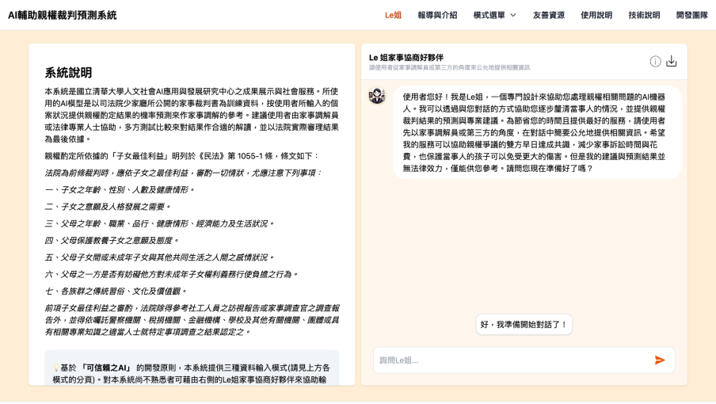
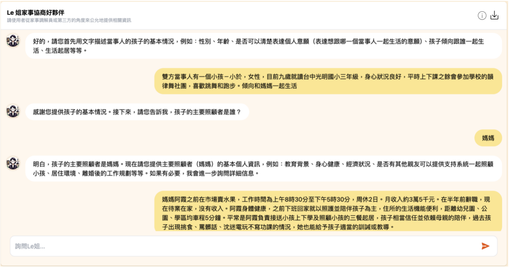
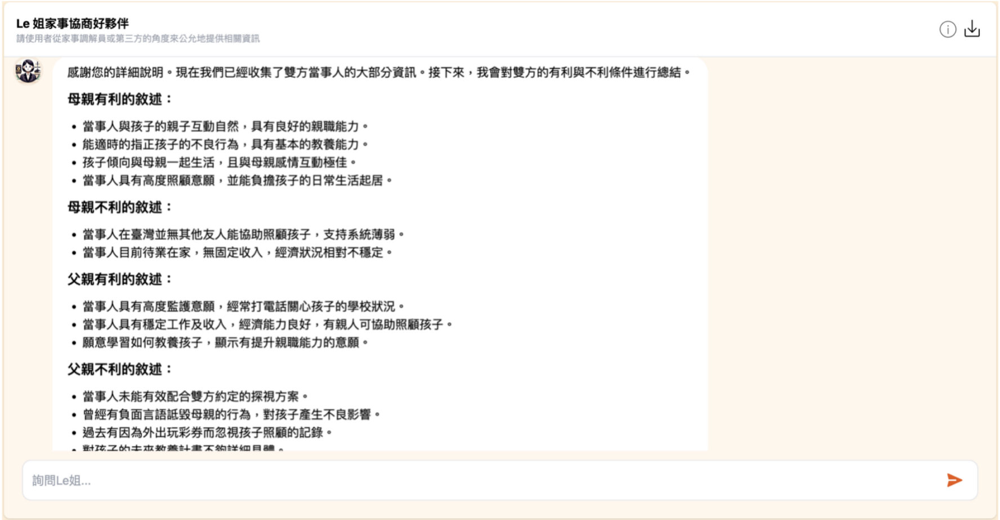
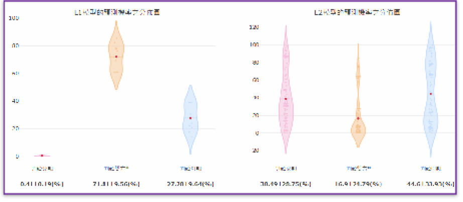
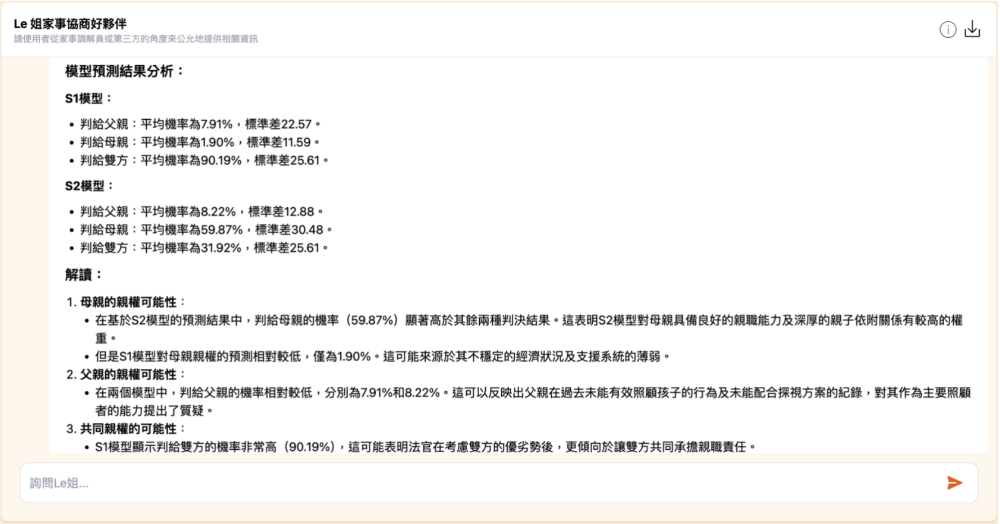
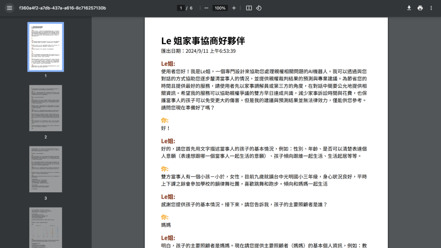

## 一、簡介：

本系統大部分的使用方式可以根據網頁的文字提示與使用者的直覺來進行，應無須另外說明，歡迎使用者儘量嘗試，相信很快可以熟悉。因此，此處僅針對比較容易有誤解的地方(多是關於名詞的定義與結果的詮釋)作進一步的說明。與AI技術相關的部分請見本系統中的「[技術說明](/technical-guide)」。

## 二、適合的使用者：

**1\. 主要對象：** 各地方法院家事調解員，或具有相關調解經驗的第三方

**使用目的：** 若當事人對於離婚後的親權有爭議，可以借此系統依過往判例提供有參考價值的預測，協助弭平當事人認知與實務上的落差，提升調解成功比例。若有需要，可以從本系統網頁「[友善資源](/friendly-resources)」尋找全台各縣市與親子或家庭有關的社福團體單位網頁，提供更多相關資源與服務。

**2\. 次要對象：** 案件當事人(考慮或申請離婚的雙方)、其親友或其委任律師

**使用目的：** 協助使用者更全面了解家事法官對於親權爭議的考量因素，模擬推演可能的情形，借此審慎評估訴訟的必要性或調整訴訟的策略，減少花費不必要的金錢或時間，避免離婚後的親權爭議進一步擴大家庭傷痕。若有需要，可以從本系統網頁「[友善資源](/friendly-resources)」尋找全台各縣市與親子或家庭有關社福團體單位網頁，得到更多相關資源與服務。

## 三、使用原則：

**1\. 避免偏頗：** 本系統是以各地方法院的實際案件作為AI的訓練資料，使用時應提供「父母雙方」對於爭取未成年子女親權的有利或不利條件，才會得到比較有參考性的結果。若僅有當事人一方使用，也請客觀評估對方的有利之處與自身的不利之處再使用，若能透過有經驗的家事調解員協助會更有效果。

**2\. 適切表達：** 本系統有三種不同的輸入模式，「模式一」只須點選符合的選項，比較快速但準確率較差。「模式三」需要同時輸入選項與文字，較為耗時但準確度較高。「模式二」僅需直接輸入文字描述，輸入時間與準確度界於前兩者之間。建議使用者先記錄下心目中的個案狀況，再依最合適的資訊表達方式來使用。模式一與三的選項定義，請見游標浮出的說明或最後的附註。

**3\. 多方測試：** 每次執行裁判預測的時間僅需幾秒鐘的時間，因此使用者不應拘泥於某一次的結果，反而應該多方測試來比較結果(例如，如果不太確定某些因素是否該輸入，可以分不同次測試)，才會對AI模擬法院判決的原則(即所謂的「未成年子女之最佳利益」有更清楚的了解，也會因此了解哪些因素可能更為重要或不如想像中重要，而非憑個人單方的想像或標準來判斷。

**4\. 正確解讀：** 每次預測的結果是以「判給父親」、「判給母親」、「判給雙方」三種結果的機率分布(小提琴圖)來呈現，亦提供平均值與標準差。小提琴圖中的紅色點代表機率的平均值，而其橫向寬度的變化代表機率分布的情形。如果其中任兩者的機率分布有高度重疊，則代表可能其結果屬於易有分歧的情形。此外不同模型的結果也可能不同，需要正確的解讀，避免誤解。

## 四、Le姐家事協商好夥伴的使用說明：

一、使用者(可能是當事人自己，或是當事人與社工一起)進入「AI輔助親權裁判預測系統」的[網頁](https://hssai-custodiai.phys.nthu.edu.tw/)，會先看見一個對話框，其中Le姐被設定為調解員的助手，會按著民法1055-1條的精神，協助使用者在對話中逐步釐清整件事情的樣貌，並了解從法院的角度會如何評估各項資訊對親權爭取的影響，最後提供親權裁判預測(相關的技術原理說明請見附錄一)並相關說明。具體的流程與若干測試範例如下：

二、我們利用 OpenAI GPT-4的大語言模型優秀的對話能力，開發生成式 AI 對話機器人-Le姊。通過設計結構化問答的方式，模仿家事調解庭的調解員，引導使用者以流暢且自然生活化的對話方式陳述父母雙方的條件。這些條件包括經濟狀況、教育背景、是否擁有支持系統，以及與孩子之間的親子關係、未來的教育規劃等關鍵問題。協助當事人以更自然、生活化的方式陳述雙方狀況。使用者不必擔心會被如何整理自己的處境，只需要簡回答Le姐一步一步的提問即可。如果覺得之前回答得不好也可以後來再補充，或是乾脆重新再來過即可。由於整個對話是不會被後台紀錄也不會詢問當事人的個人資料，所以使用者可以在自己的家裡安心重複的多次測試，與進到法院調解或訴訟的氛圍完全不同。

三、系統會自動將當事人提供的資訊，轉換為較為正式且法律化的語言，以對齊判決預測模型在訓練時使用的判決書用語。此時也會從輸入的文字中整理出當事人雙方對於爭取親權的有利條件、不利條件，以及無關的條件。並且請使用者確認是否需要修改的。

四、Le姐將AI親權裁判預測模型所預測的結果輸出。有別於過去分類模型只提供一個預測結果，當AI預測錯誤使用者就會因難以甄別而被錯誤的預測結果誤導，本系統會提供的預測結果是以機率分佈圖的形式呈現(也就是父親獨任親權的機率分布、母親獨任親權的機率分部、以及雙方共任親權的機率分布，包括多次預測之間的平均值與標準差。Le姐也會同時生成這個結果的自動說明，以文字說明的方式表達可能的情況，協助當事人更加理解 AI 預測結果的意涵。

五、當事人若對預測結果有任何疑問，亦可隨時向 Le 姐提出，獲得即時的回答。而Le姐也會重複提醒這個預測結果只是提供參考、最後仍須以法院裁判為主。有興趣的讀者可以參考三個模擬的對話輸出紀錄。

Le姐做完結果解讀後，會詢問使用者是否要下載對話紀錄。有需要的使用者可點選「下載對話紀錄」之按鈕以保留本次與Le姊的對話內容，包含模型預測結果與結果解讀等資訊。

## 五、模式一的範例與相關說明：

_提醒：此模式僅輸入因素選項，較為方便快速，但需要了解各因素的內涵。雙方都必須輸入至少一個有利因素。不利的理由並非必填，若有的話會有助於較準確的預測。無論有利或不利的因素僅填寫認為最重要的幾項即可，關於這些因素的具體定義可見於系統上游標浮現的黑底白字的說明或本說明書最後的附錄。_

- 對父親有利因素：意願能力、支持系統、父母經濟
- 對母親有利因素：意願能力、主要照顧、親子感情
- 對父親不利因素：父母品行、親子感情
- 對母親有利因素：父母經濟、父母生活

然後按「申請預測」會得到以下的兩張小提琴圖與預測到的機率。

**預測結果解讀：** 由以上的結果可以發現，即使父母兩人都有一樣多的有利條件與不利條件，但是L1與L2兩個模型有相當一致的結果，認為判給父親的機率都遠低於判給母親的機率。判給雙方的機率也不高。判給母親的機率分布與判給父親或判給雙方的機率分布只有非常少的重疊，代表此結果有相當的可信度。整體而言右側(L2)的模型準確度較左側(L1)高，但絕不代表每件個案都是如此，所以此處提供兩個模型的結果互相比較為參考。

## 六、模式二的範例與相關說明：

_提醒：此模式僅輸入理由文字，準確度較高但略為耗時。雙方都必須輸入至少一個有利的理由文字，並且儘量以「當事人」作為父母兩邊的代稱，用「小孩」或「孩子」作被監護人(未成年人)的代稱。可以先從右方黑色按鈕「新增範例文字」中選擇一些較為接近的描述，然後再作修改。不利的理由並非必填，若有的話會有助於更準確預測。但無論有利或不利的因素皆毋須鉅細靡遺，僅填寫認為最重要的幾項即可。所使用的文字描述儘量清楚表達，不必過多細節描述。_

- 對父親有利的理由文字：當事人具有高度監護意願，平日會與小孩聯繫並關心其生活狀況。當事人願意具有基本的教養能力。有穩定工作及收入，能滿足基本生活所需，經濟能力穩定。
- 對母親有利的理由文字：當事人與孩子親子互動自然，具有良好的親職能力。能適時的指正孩子的不良行為，具有基本的教養能力。
- 對父親不利的理由文字：當事人時常會玩彩券而未能善盡照顧孩子之責任。
- 對母親不利的理由文字：當事人在臺灣無其他友人能協助照顧孩子，支持系統薄弱。

**預測結果解讀：** 由以上的結果可以發現，S1與S2兩個模型所預測的結果都顯示判給雙方的平均機率是最高的，至少有達到60%以上。但是S1模型認為判給父親與母親的機率都偏低，但S2模型則顯示判給母親的平均機率雖然低於判給雙方，但其機率分布與後者仍有相當大的重疊區域。這顯示至少在S2模型中，判給母親的機率與判給雙方的機率差異可能沒有那麼大，不同法官也許會有不同的判決結果。所以比較合理的解讀是，父親想要單獨贏得親權的機率不大，最有可能的是雙方共享親權。整體而言右側(S2)的模型準確度較左側(S1)高，但絕不代表每件個案都是如此，所以此處提供兩個模型的結果互相比較為參考。

###### 七、模式三的範例與相關說明

_提醒：此模式的選項因素與理由文字需要同時使用，準確度最高但可能也是最耗時的。雙方都必須輸入至少一個有利的因素與理由文字，並且儘量以「當事人」作為父母兩邊的代稱，用「小孩」或「孩子」作被監護人(未成年人)的代稱。不利的理由並非必填，若有的話會有助於更準確預測。但無論有利或不利的因素皆毋須鉅細靡遺，僅填寫認為最重要的幾項即可。輸入方式請見以下步驟。所使用的文字描述儘量清楚表達，不必過多細節描述。_

**步驟1.** 可以先從下方橘色按鈕「新增因素與理由」增加一個選單，畫面如下

**步驟2.** 再從藍色的「選擇因素與理由範例」中選擇一個最符合的因素與其範例文字填入。例如，如果選「親子感情」，此畫面就會變成

**步驟3.** 若範例文字不符合實際的狀況，可以再直接進行修改。

**步驟4.** 若要再增加一個因素與理由可按「新增因素與理由」，重複以上步驟。移除該因素與理由時，請點右方紅色的回收桶符號可刪除最近一次的內容。

**步驟5.** 若要調整已經選取的因素或所輸入的文字，僅需再點一次藍色的「選擇因素與理由範例」，再進行修改即可。

**步驟6.** 請依序填完雙方的有利因素與理由。不利的因素與理由並非必填。但若有的話會有助於準確預測，但無論有利或不利的因素皆毋須鉅細靡遺。

- 對父親有利的因素與理由：1.親子感情：孩子習慣由當事人照顧生活及一起行動，表現出對其依賴與信任，互動緊密。2.支持系統：當事人的家人皆為友善之親屬，可以在有需要的時候協助照顧孩子的生活起居。
- 對母親有利的因素與理由：主要照顧：孩子自幼即與當事人同住，由當事人擔任其主要生活照顧者，目前生活平順，應減少不必要的變動。
- 對父親不利的理由文字：無。
- 對母親不利的理由文字：父母生活：當事人的居住地點附近環境複雜，且屋內並無孩子獨立的失活空間，居家環境不太適合孩子成長。

**預測結果解讀：** 由以上的結果可以發現，C1與C2兩個模型所預測的結果共同的地方是，判給母親單獨親權的機率都是最低的。其差異在於C1顯示判給雙方的平均機率比較高，但C2顯示判給父親的機率比較高。只是C1的結果中，判給父親與判給雙方的機率分布仍有相當大的重疊區域，這顯示至少在C1模型中，兩者的差異並不大，不同法官也許會有不同的判決結果。所以比較合理的解讀是，母親想要單獨贏得親權的機率不大，最有可能的是雙方共享親權或是父親獨享親權。若要更仔細的評估，建議嘗試調整文字描述補充，或是調整相關考量因素的內容再做比較。整體而言右側(C2)的模型準確度較左側(C1)高，但絕不代表每件個案都是如此，所以此處提供兩個模型的結果互相比較為參考。

## 附錄：

本系統中與親權裁判相關的考量因素全稱、簡稱與其操作型定義。為避免相關用語上的誤解。

| 編號     | 因素全稱                | 因素簡稱    | 操作型定義的說明                                                 |
| -------- | ----------------------- | ----------- | ---------------------------------------------------------------- |
| 子女方面 | 1 子女年齡              | 子女年齡    | 裁判書有特別提及為考量因素才列入                                 |
| 子女方面 | 2 子女意願              | 子女意願    | 希望與雙親中哪一位共同生活，包括意願或態度                       |
| 子女方面 | 3 子女人格發展          | 人格發展    | 對子女未來成長的影響(如能否穩定就學或有價值觀偏差)               |
| 父母方面 | 4 父母職業              | 父母職業    | 工作性質對子女照顧的影響(如常有夜班或出差的情形)                 |
| 父母方面 | 5 父母經濟狀況          | 父母經濟    | 收入是否穩定且足以負擔子女養育所需，是否過度負債影響生計         |
| 父母方面 | 6 父母健康狀況          | 父母健康    | 心理或身體是否有不良狀況而不適任為子女照顧者                     |
| 父母方面 | 7 父母品行              | 父母品行    | 是否有不良嗜好、家庭暴力、精神虐待、吸毒或入監的紀錄             |
| 父母方面 | 8 父母生活狀況          | 父母生活    | 居家環境、是否有足夠空間或生活作習是否合適扶養子女               |
| 父母方面 | 9 是否為主要照顧者      | 主要照顧    | 過往長期照顧且了解子女的生活情形，包括當前照顧的狀態是否應繼續   |
| 父母方面 | 10 父母的意願與親職能力 | 意願能力[1] | 是否有積極(或消極)扶養的意願，相關扶養規劃與適合的親職能力       |
| 父母方面 | 11 是否為友善父母       | 友善父母    | 是否在子女面前誹謗對方，或阻擾對方與子女維持親子關係(含會面交往) |
| 共同方面 | 12 父母子女間的感情     | 親子感情    | 親子彼此互動的模式是否親密，子女是否有信賴/依附關係或害怕相處    |
| 共同方面 | 13 父母與子女的支持系統 | 支持系統    | 其他親友是否能協助子女的生活照顧或父母的經濟支持                 |

\[1\]「父母的意願與親職能力」這個因素的全稱包含了兩個看似應該獨立的概念，也就是扶養的意願與能力。但是本研究所蒐集的案件都是兩造辯論，也就是至少在形式上是雙方都有扶養意願的判決。因此關於父母意願的部分，法官於判決書中多會以其積極性的作為來描述，而同時提及為了扶養孩子而有的扶養經驗與相關規劃，也就牽涉到親職能力的部分。因此本研究認為此兩者雖然在概念上是獨立的，但是在司法實務上常是緊密相連的，與其勉強區分不如合併考慮。但不排除未來可能可以透過更明確的定義或更仔細的研究來有所區別。
